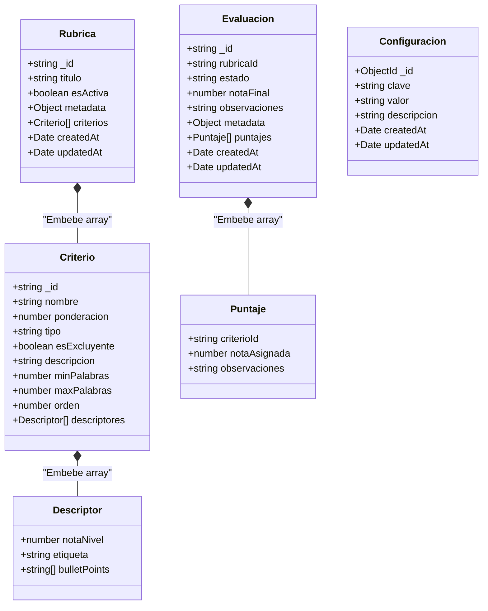
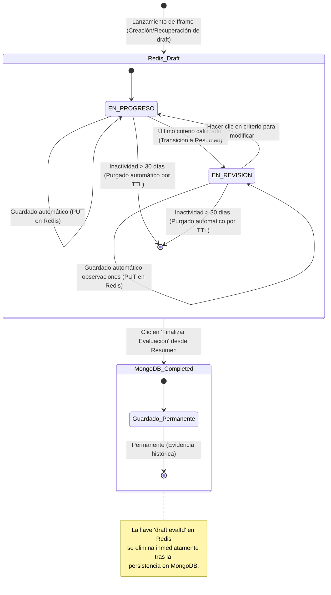

# Base de Datos — EvalUA v3.0 (MongoDB + Redis)

> **Especificación de Almacenamiento NoSQL — EvalUA**  
> **Motor Principal:** MongoDB (Mongoose ORM)  
> **Almacén Volátil y Caché L2:** Redis  
> **Estructura de Datos:** Colecciones documentales anidadas y llaves de acceso en memoria.

---

## 1. Visión General de la Topología de Datos

EvalUA v3.0 utiliza una arquitectura de datos híbrida NoSQL:

1. **MongoDB (Persistencia Estructurada):** Almacena de forma inmutable los documentos de Rúbricas (con sus criterios y descriptores embebidos), Evaluaciones finalizadas (con sus puntajes embebidos) y Configuraciones del sistema.
2. **Redis (Almacén en Memoria de Alto Rendimiento):** Guarda los borradores activos de evaluaciones en curso con tiempo de vida (TTL) automatizado y opera como una caché de segunda capa (L2) para acelerar la inicialización de rúbricas en el iframe.

```
                  ┌─────────────────────────────────────┐
                  │          Host Launch JWT            │
                  └──────────────────┬──────────────────┘
                                     │
                                     ▼
                  ┌─────────────────────────────────────┐
                  │       ¿Existe Evaluación en Redis?  │
                  └──────┬───────────────────────┬──────┘
                         │ (Sí: Cargar borrador) │ (No)
                         ▼                       ▼
                  ┌──────────────┐       ┌──────────────┐
                  │    Redis     │       │   MongoDB    │
                  │ draft:evalId │       │ evaluaciones │ (Carga finalizada en sólo lectura)
                  └──────────────┘       └──────────────┘
```

---

## 2. Diagrama de Estructuras Documentales (NoSQL)



---

## 3. Colecciones en MongoDB (Esquemas Mongoose)

### 3.1 Colección `rubricas`
Rúbricas del sistema. Implementa el Agregado `Rubrica` embebiendo criterios y descriptores en el mismo documento.
```typescript
const DescriptorSchema = new Schema({
  notaNivel: { type: Number, required: true, min: 1, max: 7 },
  etiqueta: { type: String, required: true },
  bulletPoints: [{ type: String }]
});

const CriterioSchema = new Schema({
  _id: { type: String, required: true }, // Asignado en dominio (UUID)
  nombre: { type: String, required: true },
  ponderacion: { type: Number, required: true, min: 0.0, max: 1.0 },
  tipo: { type: String, enum: ["ESTRUCTURAL", "COMPLEMENTARIO"], default: "ESTRUCTURAL" },
  esExcluyente: { type: Boolean, default: false },
  descripcion: { type: String, default: null },
  minPalabras: { type: Number, default: null },
  maxPalabras: { type: Number, default: null },
  orden: { type: Number, default: 0 },
  descriptores: [DescriptorSchema] // Embebido
});

const RubricaSchema = new Schema({
  _id: { type: String, required: true }, // Asignado en dominio (UUID)
  titulo: { type: String, required: true },
  esActiva: { type: Boolean, default: true, index: true },
  metadata: { type: Schema.Types.Mixed, default: null },
  criterios: [CriterioSchema] // Embebido (Agregado DDD)
}, { timestamps: true });
```

---

### 3.2 Colección `evaluaciones`
Evaluaciones finalizadas e inmutables (estado `COMPLETADA`). Embebe los puntajes asignados.
```typescript
const PuntajeSchema = new Schema({
  criterioId: { type: String, required: true },
  notaAsignada: { type: Number, required: true, min: 1.0, max: 7.0 },
  observaciones: { type: String, default: null }
});

const EvaluacionSchema = new Schema({
  _id: { type: String, required: true }, // Asignado por el Host o autogenerado
  rubricaId: { type: String, ref: 'Rubrica', required: true, index: true }, // Referencia por String UUID
  estado: { type: String, enum: ["COMPLETADA"], default: "COMPLETADA" },
  notaFinal: { type: Number, required: true },
  observaciones: { type: String, default: null },
  metadata: { type: Schema.Types.Mixed, default: null },
  puntajes: [PuntajeSchema] // Embebido (Agregado DDD)
}, { timestamps: true });
```

---

### 3.3 Colección `configuraciones`
Parámetros de uso de consola.
```typescript
const ConfiguracionSchema = new Schema({
  clave: { type: String, required: true, unique: true, index: true },
  valor: { type: String, required: true },
  descripcion: { type: String, required: true }
}, { timestamps: true });
```

---

## 4. Estructura de Datos y Llaves en Redis

Redis opera como almacén temporal, persistencia de borradores de auto-guardado rápidos y caché de lectura.

### 4.1 Borradores de Evaluaciones en Curso (Auto-save)
- **Llave:** `draft:{evaluacionId}`
- **Tipo de Dato:** String (JSON serializado de la evaluación activa).
- **TTL (Expiración):** 30 días (`2592000` segundos) desde la última actualización de calificación.
- **Estructura JSON almacenada:**
  ```json
  {
    "evaluacionId": "uuid-evaluacion-123",
    "rubricaId": "uuid-rubrica-456",
    "estado": "EN_PROGRESO", // "EN_PROGRESO" o "EN_REVISION"
    "observaciones": "Avances preliminares del proyecto...",
    "metadata": {
      "usuarioId": "evaluador.id",
      "origen": "LMS-Host"
    },
    "puntajes": [
      { "criterioId": "uuid-crit-1", "notaAsignada": 6.0, "observaciones": "Modularización adecuada" },
      { "criterioId": "uuid-crit-2", "notaAsignada": 5.2, "observaciones": null }
    ],
    "updatedAt": "2026-06-10T22:10:00Z"
  }
  ```

### 4.2 Caché de Lectura L2 (Segunda Capa)
Para evitar lecturas redundantes en la base documental MongoDB al levantar múltiples iframes con la misma rúbrica.
- **Rúbrica Detallada:** `cache:rubrica:{rubricaId}`
  - **Dato:** String (JSON de Rúbrica completa con criterios/descriptores).
  - **TTL:** 24 horas (`86400` segundos). *Se invalida (DEL) automáticamente ante cualquier actualización en el CRUD de rúbricas.*
- **Configuraciones Globales:** `cache:configuracion`
  - **Dato:** String (JSON de configuraciones).
  - **TTL:** 24 horas. *Se invalida ante actualizaciones del Administrador.*

---

## 5. Esquema de Claims JWT reconocidos por EvalUA

Para autorizar el acceso a las vistas embebidas en el iframe, el Host debe emitir un token JWT firmado simétricamente que contenga los siguientes claims reconocidos por EvalUA:

| Claim | Tipo | Requerido | Descripción |
|---|---|---|---|
| `id_plataforma` | string | Sí | Identificador de la plataforma Host. Debe coincidir con `ENV.ID_PLATAFORMA`. |
| `rol` | string | Sí | Rol del usuario: `ADMINISTRADOR`, `MANTENEDOR`, `PROFESOR`, `ALUMNO` |
| `usuario_id` | string | No | Identificador del usuario para trazabilidad interna (quién creó/modificó/evaluó) |
| `rubrica_id` | string | Condicional | Requerido para modo `evaluar`. UUID de la rúbrica a utilizar. |
| `evaluacion_id` | string | Condicional | Requerido para modos `resultado` y `evaluar` (si se retoma un borrador). |
| `puede_ver_rubricas_ajenas` | boolean | No | Si es `true`, el mantenedor puede ver rúbricas creadas por otros mantenedores. Por defecto `false`. |
| `iss` | string | Sí | Emisor del token (identificación del Host). |
| `aud` | string | Sí | Audiencia: `"evalua-microservice"`. |
| `exp` | number | Sí | Expiración del token (5 minutos recomendados para lanzamiento). |

---

## 6. Ciclo de Vida y Transiciones de Datos NoSQL


