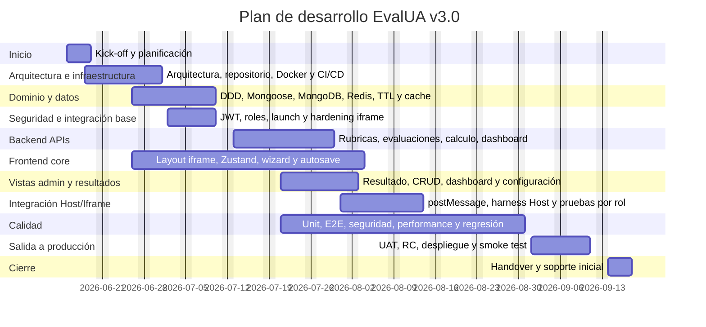

A continuación propongo un **plan de desarrollo detallado para EvalUA v3.0**, preparado para transformarse directamente en una **carta Gantt**. Está basado en el alcance técnico documentado: micro-frontend NoSQL con Next.js 16, MongoDB, Redis, Docker, JWT HS256, vistas embebidas en iframe 1029×466, DDD, auto-save, postMessage, CRUD de rúbricas, dashboard, configuración y resultados. La arquitectura y stack están definidos como Next.js 16, TypeScript, Mongoose/MongoDB, Redis, JWT simétrico, Zustand, shadcn/ui, Docker/Docker Compose y Framer Motion. 

## Supuestos de planificación

**Fecha de inicio sugerida:** lunes 15 de junio de 2026.
**Calendario:** lunes a viernes, sin fines de semana.
**Duración total:** 14 semanas calendario, incluyendo estabilización post-producción.
**Hito de salida productiva:** 11 de septiembre de 2026.
**Hito de cierre/estabilización:** 18 de septiembre de 2026.
**Modalidad:** desarrollo incremental con frentes paralelos de backend, frontend, integración Host/Iframe, QA y DevOps.

El plan considera que EvalUA no tendrá consola independiente ni usuarios locales, sino vistas embebidas accedidas por JWT y controladas por roles desde el Host; esto impacta directamente las actividades de seguridad, permisos, pruebas por rol y validación de integración iframe.

**Impacto de la Mitigación de Riesgos de Diseño:** Dado que el *Plan de Trabajo para la Mitigación de Riesgos de Diseño* (`11-plan-riesgo.md`) y la `10-matriz-riesgo.md` ya resolvieron preventivamente las definiciones arquitectónicas más complejas (modelos DDD inmutables, matriz de acceso Zero-Knowledge, viewport estricto, estrategias TTL en Redis y transaccionalidad), las fases tempranas de este proyecto (Arquitectura, Dominio y Seguridad) entran directamente a una **fase de codificación y ejecución**, reduciendo significativamente la incertidumbre, el esfuerzo de diseño y la probabilidad de retrasos iniciales.

---

## Roles del proyecto

| Rol                                    | Responsabilidades principales                                                                               |
| -------------------------------------- | ----------------------------------------------------------------------------------------------------------- |
| **PM / Jefe de Proyecto**              | Planificación, control de avance, gestión de riesgos, coordinación de hitos, seguimiento de carta Gantt.    |
| **Product Owner / Analista Funcional** | Refinamiento de historias HU-03 a HU-11, criterios de aceptación, validación UAT.                           |
| **Arquitecto / Tech Lead**             | Decisiones técnicas, DDD, revisión de arquitectura NoSQL, estándares de código, definición de ruta crítica. |
| **Desarrollador Backend**              | APIs REST, controladores Next.js, Mongoose, Redis, JWT, cálculo de nota, reglas Gatekeeper.                 |
| **Desarrollador Frontend**             | Vistas iframe, wizard, CRUD de rúbricas, resultados, dashboard, configuración, Zustand y componentes UI.    |
| **UX/UI**                              | Diseño compacto 1029×466, accesibilidad, scroll local, consistencia visual con paleta institucional.        |
| **QA / QA Automation**                 | Estrategia de pruebas, pruebas funcionales, integración, regresión, E2E, seguridad y performance.           |
| **DevOps / DBA**                       | Docker Compose, MongoDB, Redis, variables de entorno, CI/CD, despliegue, monitoreo y respaldo.              |
| **Especialista Seguridad**             | Validación JWT, permisos por rol, CSP, zero-knowledge, hardening de iframe.                                 |
| **Integrador Host**                    | Generación de JWT, embebido iframe, listeners postMessage, pruebas Host/EvalUA.                             |

La separación de roles se alinea con la guía técnica: backend debe concentrarse en JWT, APIs, Redis y MongoDB; frontend en vistas embebidas, wizard y postMessage; infraestructura en Docker, MongoDB, Redis y gobierno de datos. 

---

## Plan por fases

| Fase                                     |      Semanas | Objetivo                                                               | Resultado esperado                                                |
| ---------------------------------------- | -----------: | ---------------------------------------------------------------------- | ----------------------------------------------------------------- |
| 0. Inicio y planificación                |     Semana 1 | Alinear alcance, historias, riesgos y criterios de aceptación.         | Backlog trazable, DoD/DoR, plan QA y plan base Gantt.             |
| 1. Arquitectura e infraestructura base   |  Semanas 1–3 | Preparar base técnica del proyecto.                                    | Repositorio, Docker Compose, CI/CD, entornos y estándares.        |
| 2. Dominio y datos                       |  Semanas 2–4 | Implementar agregados DDD, MongoDB y Redis.                            | Entidades, esquemas, repositorios, TTL, caché e índices.          |
| 3. Seguridad e integración base          |  Semanas 3–4 | Implementar JWT, roles, launch y hardening iframe.                     | Middleware, permisos, `/api/embed/launch`, CSP y errores 401/403. |
| 4. Backend APIs                          |  Semanas 5–7 | Implementar APIs de rúbricas, evaluaciones, dashboard y configuración. | Controladores probados e integrados con MongoDB/Redis.            |
| 5. Frontend core                         |  Semanas 2–8 | Construir layout iframe, store y wizard de evaluación.                 | Wizard completo con auto-save, resumen y finalización.            |
| 6. Vistas de administración y resultados |  Semanas 6–8 | Construir resultado, CRUD de rúbricas, dashboard y configuración.      | Vistas embebidas por rol, compactas y funcionales.                |
| 7. Integración Host/Iframe               |  Semanas 7–9 | Conectar EvalUA con Host mediante JWT y postMessage.                   | Eventos, harness de integración y pruebas por rol.                |
| 8. Calidad, seguridad y performance      | Semanas 6–12 | Validar flujos críticos, permisos, rendimiento y regresión.            | Suite QA, defectos corregidos, sistema endurecido.                |
| 9. Salida a producción                   | Semanas 5–13 | Preparar operación, UAT, release candidate y despliegue.               | UAT aprobado, runbooks, staging y producción.                     |
| 10. Cierre y estabilización              |    Semana 14 | Transferencia, soporte inicial y cierre.                               | Handover, documentación final y soporte post-go-live.             |

El backend debe cubrir operaciones CRUD de rúbricas con cache L2, auto-save en Redis, consolidación final en MongoDB y eliminación del borrador Redis al finalizar.  El frontend debe cubrir layout embebido, wizard, resultado, rúbricas, dashboard y configuración dentro del route group `(embed)` y viewport fijo. 

---

## Tabla Gantt-ready detallada

Esta tabla puede copiarse a Excel, MS Project, ProjectLibre, Smartsheet, Jira Advanced Roadmaps o cualquier herramienta Gantt. Las columnas clave son: **ID**, **actividad**, **inicio**, **fin**, **duración**, **predecesoras** y **responsable**.

| ID   | Fase                    | Actividad / entregable                                                          | Duración | Inicio     | Fin        | Predecesoras       | Responsable                |
| ---- | ----------------------- | ------------------------------------------------------------------------------- | -------: | ---------- | ---------- | ------------------ | -------------------------- |
| 0.1  | Inicio                  | Kick-off, alcance, riesgos y criterios de éxito                                 |   2 días | 2026-06-15 | 2026-06-16 | —                  | PM / PO / TL               |
| 0.2  | Inicio                  | Refinamiento de backlog HU-03 a HU-11 y matriz de trazabilidad                  |   3 días | 2026-06-15 | 2026-06-17 | —                  | PO / BA / QA               |
| 0.3  | Inicio                  | Definición de DoR/DoD, estrategia de pruebas y ambientes                        |   2 días | 2026-06-18 | 2026-06-19 | 0.2                | PM / QA Lead / DevOps      |
| 1.1  | Arquitectura            | Implementación técnica de ADRs, diseño DDD/NoSQL y modelo Zero-Knowledge ya definidos           |   3 días | 2026-06-18 | 2026-06-22 | 0.2                | Arquitecto / TL            |
| 1.2  | Arquitectura            | Inicialización repositorio Next.js 16 + TypeScript + shadcn/ui + Zustand        |   3 días | 2026-06-23 | 2026-06-25 | 1.1                | Frontend / TL              |
| 1.3  | Arquitectura            | Docker Compose: `evalua-app`, MongoDB, Redis y variables de entorno             |   4 días | 2026-06-23 | 2026-06-26 | 1.1                | DevOps / DBA               |
| 1.4  | Arquitectura            | CI/CD base: lint, typecheck, tests, build y gestión de secretos                 |   3 días | 2026-06-29 | 2026-07-01 | 1.2, 1.3           | DevOps / TL                |
| 2.1  | Dominio y datos         | Codificación de Entidades DDD pre-modeladas: Rubrica inmutable, Evaluacion (FSM)                |   4 días | 2026-06-26 | 2026-07-01 | 1.2                | Backend / TL               |
| 2.2  | Dominio y datos         | Esquemas Mongoose, repositorios MongoDB e índices                               |   4 días | 2026-07-02 | 2026-07-07 | 2.1, 1.3           | Backend / DBA              |
| 2.3  | Dominio y datos         | Cliente Redis: `draft:{id}`, `cache:rubrica:{id}`, TTL e invalidación           |   3 días | 2026-06-29 | 2026-07-01 | 1.3                | Backend / DevOps           |
| 2.4  | Dominio y datos         | Seeds de configuración, datos de prueba y validación de persistencia            |   3 días | 2026-07-08 | 2026-07-10 | 2.2, 2.3           | Backend / QA               |
| 3.1  | Seguridad e integración | Codificación de Middleware JWT HS256 basado en Matriz Zero-Knowledge aprobada                   |   4 días | 2026-07-02 | 2026-07-07 | 1.4                | Backend / Seguridad        |
| 3.2  | Seguridad e integración | Endpoint `/api/embed/launch` y resolución de modo autorizado                    |   3 días | 2026-07-08 | 2026-07-10 | 3.1, 2.3           | Backend                    |
| 3.3  | Seguridad e integración | Cabeceras CSP/frame-ancestors, errores 401/403 y hardening iframe               |   2 días | 2026-07-08 | 2026-07-09 | 3.1                | Backend / Seguridad        |
| 4.1  | Backend API             | APIs CRUD de rúbricas con ownership, cache L2 y versionamiento                  |   6 días | 2026-07-13 | 2026-07-20 | 2.4, 3.1           | Backend                    |
| 4.2  | Backend API             | APIs de evaluación: crear, recuperar y auto-guardar borradores                  |   4 días | 2026-07-13 | 2026-07-16 | 2.4, 3.1           | Backend                    |
| 4.3  | Backend API             | API de cálculo/consolidación con Gatekeeper y borrado de draft Redis            |   4 días | 2026-07-17 | 2026-07-22 | 4.2, 2.1           | Backend / TL               |
| 4.4  | Backend API             | APIs dashboard y configuración con control de rol                               |   4 días | 2026-07-21 | 2026-07-24 | 4.1                | Backend                    |
| 4.5  | Backend API             | Pruebas de integración de APIs y contratos de error                             |   4 días | 2026-07-27 | 2026-07-30 | 4.1, 4.2, 4.3, 4.4 | QA / Backend               |
| 5.1  | Frontend                | Layout embebido 1029×466, variables CSS y componentes base                      |   4 días | 2026-06-26 | 2026-07-01 | 1.2                | Frontend / UX              |
| 5.2  | Frontend                | Store Zustand, cliente API, manejo de loading/error y sesión embebida           |   3 días | 2026-07-08 | 2026-07-10 | 5.1, 3.1           | Frontend                   |
| 5.3  | Frontend                | Wizard de evaluación: criterios, descriptores, navegación y cálculo provisional |   6 días | 2026-07-13 | 2026-07-20 | 5.2                | Frontend                   |
| 5.4  | Frontend                | Auto-save, recuperación de borrador y estados `EN_PROGRESO`/`EN_REVISION`       |   4 días | 2026-07-21 | 2026-07-24 | 5.3, 4.2           | Frontend / Backend         |
| 5.5  | Frontend                | Resumen, edición desde resumen y acción “Finalizar Evaluación”                  |   4 días | 2026-07-27 | 2026-07-30 | 5.4, 4.3           | Frontend / Backend         |
| 5.6  | Frontend                | Ajustes de viewport, accesibilidad, scroll local y pruebas visuales             |   3 días | 2026-07-31 | 2026-08-04 | 5.5                | Frontend / UX / QA         |
| 6.1  | Vistas admin/resultados | Vista de resultados read-only con acordeón single-open                          |   5 días | 2026-07-23 | 2026-07-29 | 5.2, 4.3           | Frontend                   |
| 6.2  | Vistas admin/resultados | CRUD de rúbricas embebido, copiar UUID y versionamiento visual                  |   6 días | 2026-07-21 | 2026-07-28 | 5.2, 4.1           | Frontend                   |
| 6.3  | Vistas admin/resultados | Dashboard de métricas e historial compacto                                      |   3 días | 2026-07-27 | 2026-07-29 | 5.2, 4.4           | Frontend                   |
| 6.4  | Vistas admin/resultados | Panel de configuración y manejo de 403                                          |   3 días | 2026-07-27 | 2026-07-29 | 5.2, 4.4           | Frontend                   |
| 6.5  | Vistas admin/resultados | Integración y pruebas funcionales de vistas administrativas                     |   3 días | 2026-07-30 | 2026-08-03 | 6.1, 6.2, 6.3, 6.4 | QA / Frontend              |
| 7.1  | Integración Host        | Implementación de contrato estricto postMessage y validación de origin pre-definida             |   3 días | 2026-07-31 | 2026-08-04 | 5.5, 6.2           | Frontend / Integrador Host |
| 7.2  | Integración Host        | Harness de Host: generación JWT, iframe 1029×466 y listeners                    |   4 días | 2026-08-05 | 2026-08-10 | 7.1, 3.2           | Integrador Host / QA       |
| 7.3  | Integración Host        | Pruebas end-to-end Host/Iframe por rol y modo                                   |   4 días | 2026-08-11 | 2026-08-14 | 7.2, 6.5           | QA / Integrador Host       |
| 8.1  | Calidad                 | Pruebas unitarias dominio, store y componentes críticos                         |   5 días | 2026-07-21 | 2026-07-27 | 2.1, 5.3           | QA / Devs                  |
| 8.2  | Calidad                 | E2E flujos: rúbrica, evaluar, auto-save, finalizar, resultado                   |   6 días | 2026-08-17 | 2026-08-24 | 7.3, 6.5           | QA Automation              |
| 8.3  | Calidad                 | Pruebas de seguridad: JWT, roles, CSP, privacidad Zero-Knowledge                |   4 días | 2026-08-17 | 2026-08-20 | 7.3, 3.3           | QA / Seguridad             |
| 8.4  | Calidad                 | Pruebas de performance: cache HIT/MISS, autosave, carga iframe                  |   4 días | 2026-08-05 | 2026-08-10 | 4.5, 5.6           | QA / DevOps                |
| 8.5  | Calidad                 | Corrección de defectos, hardening y regression testing                          |   5 días | 2026-08-25 | 2026-08-31 | 8.2, 8.3, 8.4      | Equipo completo            |
| 9.1  | Salida producción       | UAT con PO/Host y cierre de criterios de aceptación                             |   4 días | 2026-09-01 | 2026-09-04 | 8.5                | PO / QA / Host             |
| 9.2  | Salida producción       | Runbooks, monitoreo, backups, variables y checklist operativo                   |   4 días | 2026-07-13 | 2026-07-16 | 1.4, 2.4           | DevOps / DBA               |
| 9.3  | Salida producción       | Release Candidate en staging y smoke test técnico                               |   3 días | 2026-09-07 | 2026-09-09 | 9.1, 9.2           | DevOps / QA                |
| 9.4  | Salida producción       | Despliegue productivo, smoke test funcional y rollback plan                     |   2 días | 2026-09-10 | 2026-09-11 | 9.3                | DevOps / TL / QA           |
| 10.1 | Cierre                  | Capacitación, handover técnico y documentación final                            |   2 días | 2026-09-14 | 2026-09-15 | 9.4                | PM / TL / PO               |
| 10.2 | Cierre                  | Soporte inicial post-producción y estabilización                                |   5 días | 2026-09-14 | 2026-09-18 | 9.4                | Equipo soporte             |

---

## Hitos principales

| Hito                                 |      Fecha | Criterio de cumplimiento                                                 |
| ------------------------------------ | ---------: | ------------------------------------------------------------------------ |
| H1. Backlog y plan aprobados         | 2026-06-19 | HU priorizadas, criterios de aceptación trazables y Gantt base aprobado. |
| H2. Arquitectura base operativa      | 2026-07-01 | Repositorio, Docker Compose, CI/CD y stack inicial funcionando.          |
| H3. Dominio, MongoDB y Redis listos  | 2026-07-10 | Entidades, esquemas, repositorios, TTL y caché implementados.            |
| H4. Seguridad y launch listos        | 2026-07-10 | JWT, roles, permisos por modo y endpoint de lanzamiento funcionando.     |
| H5. APIs core terminadas             | 2026-07-30 | Rúbricas, evaluaciones, cálculo, dashboard y configuración probados.     |
| H6. Wizard funcional completo        | 2026-08-04 | Layout 1029×466, auto-save, resumen y finalización implementados.        |
| H7. Integración Host/Iframe validada | 2026-08-14 | JWT de Host, iframe y postMessage probados por rol.                      |
| H8. QA integral completado           | 2026-08-31 | E2E, seguridad, performance, regresión y defectos críticos cerrados.     |
| H9. UAT aprobado                     | 2026-09-04 | PO/Host aprueban flujos HU-03 a HU-11.                                   |
| H10. Producción                      | 2026-09-11 | Despliegue, smoke test y rollback plan validados.                        |
| H11. Cierre y estabilización         | 2026-09-18 | Handover realizado y soporte inicial cerrado.                            |

Los flujos críticos de evaluación deben validar wizard paso a paso, auto-save, resumen, modificación desde resumen, cálculo final, persistencia en MongoDB y envío de `evalua.evaluation.completed` al Host, de acuerdo con las historias HU-06, HU-07 y HU-08. 

---

## Carta Gantt resumida en Mermaid

Este bloque puede pegarse en un visor compatible con Mermaid para generar una Gantt visual resumida.

---

## Ruta crítica propuesta

La ruta crítica de este plan es:

**Refinamiento backlog → Arquitectura → Docker/CI → JWT + datos → APIs evaluación → Wizard + finalización → postMessage Host → E2E Host/Iframe → Corrección defectos → UAT → Release Candidate → Producción.**

Esto se debe a que la experiencia principal depende de la combinación de backend, frontend y Host: EvalUA debe validar JWT, cargar rúbricas con cache Redis, auto-guardar borradores, pasar a revisión, consolidar en MongoDB, borrar el draft Redis y notificar al Host por postMessage. 

---

## Criterios mínimos de aceptación por bloque

| Bloque              | Criterios de aceptación                                                                                                                                  |
| ------------------- | -------------------------------------------------------------------------------------------------------------------------------------------------------- |
| **Dominio y datos** | Rúbricas con criterios/descriptores embebidos; evaluaciones con puntajes embebidos; validación de ponderaciones; nota 1.0–7.0; Gatekeeper aplicado.      |
| **Redis**           | `draft:{evaluacionId}` con TTL, `cache:rubrica:{rubricaId}` con TTL, invalidación al modificar rúbrica.                                                  |
| **Seguridad**       | JWT HS256, claims requeridos, roles `ADMINISTRADOR`, `MANTENEDOR`, `PROFESOR`, `ALUMNO`, errores 401/403, CSP.                                           |
| **Backend**         | CRUD rúbricas, versionamiento, evaluación, auto-save, cálculo, dashboard, configuración.                                                                 |
| **Frontend**        | Viewport 1029×466, sin scroll raíz, wizard compacto, resumen, resultados read-only, CRUD, dashboard y configuración.                                     |
| **Host/Iframe**     | Eventos `evalua.ready`, `evalua.evaluation.reviewing`, `evalua.evaluation.completed`, `evalua.rubrica.created`, `evalua.config.updated`, `evalua.error`. |
| **QA**              | Unitarias, integración API, E2E, seguridad, performance cache/autosave y regresión.                                                                      |
| **Producción**      | Docker Compose listo, variables seguras, runbook, smoke test, rollback y soporte inicial.                                                                |

La política zero-knowledge debe mantenerse durante todo el desarrollo: EvalUA no almacena nombres, correos, RUTs ni datos personales; el Host mantiene el mapeo entre `evaluacionId` e identidad real del estudiante. 
